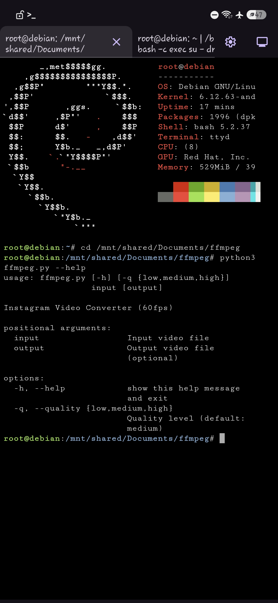
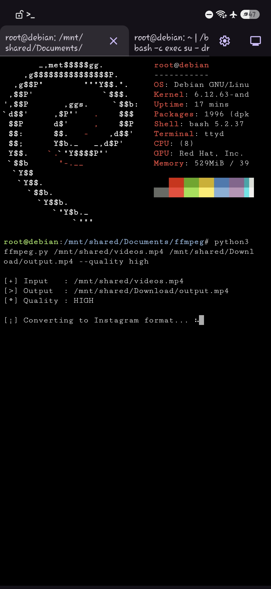
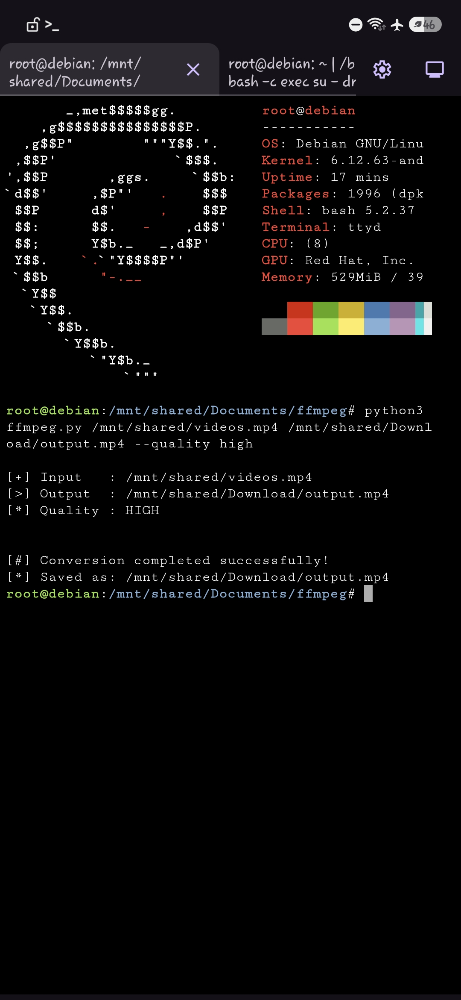

[](https://github.com/BlackHoleSecurity)


Author : ITermSec

# ffmpeg converter
*Simplify converting videos.mp4 for smooth Instagram Story uploads.*

## Screenshots
  
  
  

**Installation**:

`~# apt-get install -y python3 ffmpeg git`

`~# git clone https://github.com/BlackHoleSecurity/ffmpeg.git`


**Usage**:

```~# python3 ffmpeg.py --help
usage: ffmpeg.py [-h] [-q {low,medium,high}]
                 input [output]

Instagram Video Converter (60fps)

positional arguments:
  input                 Input video file
  output                Output video file
                        (optional)

options:
  -h, --help            show this help message
                        and exit
  -q, --quality {low,medium,high}
                        Quality level (default:
                        medium)```
